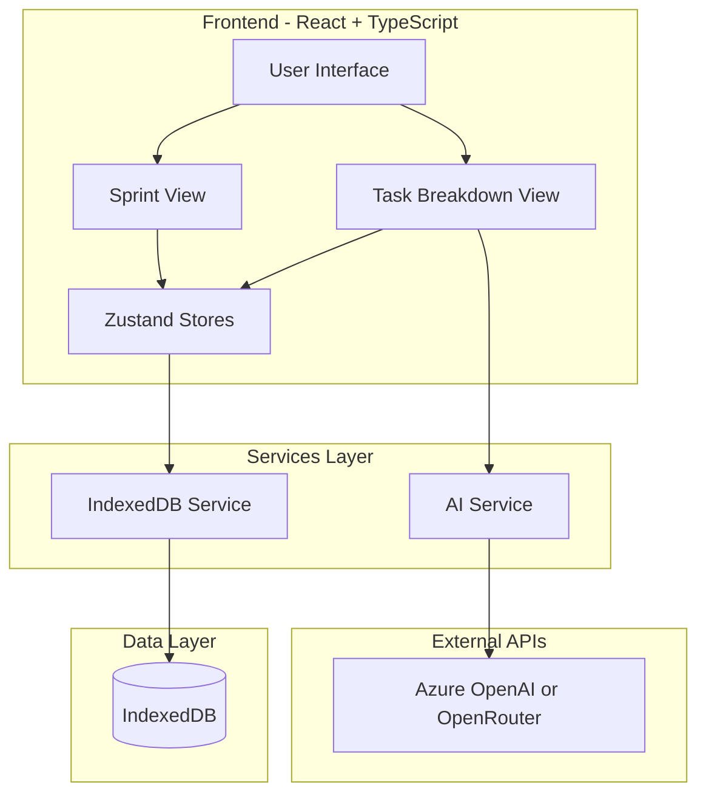
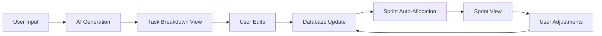
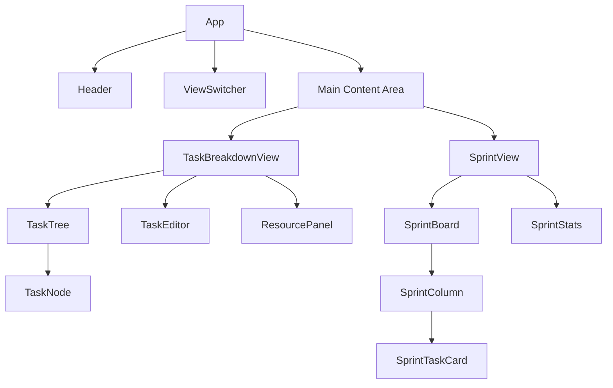
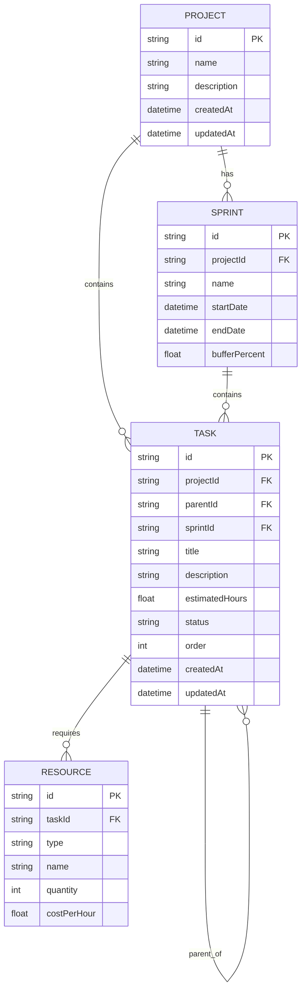
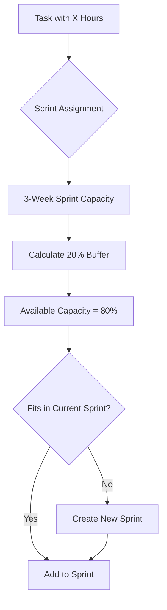

# System Architecture

## High-Level Architecture

```mermaid
flowchart TB
    subgraph Frontend["Frontend - React + TypeScript"]
        UI[User Interface]
        TBV[Task Breakdown View]
        SV[Sprint View]
        State[Zustand Stores]
    end
    
    subgraph Services["Services Layer"]
        AI[AI Service]
        DB[IndexedDB Service]
    end
    
    subgraph External["External APIs"]
        AIProvider[Azure OpenAI or OpenRouter]
    end
    
    subgraph Data["Data Layer"]
        IDB[(IndexedDB)]
    end
    
    UI --> TBV
    UI --> SV
    TBV --> State
    SV --> State
    State --> DB
    TBV --> AI
    AI --> AIProvider
    DB --> IDB
```

## Data Flow

```mermaid
flowchart LR
    A[User Input] --> B[AI Generation]
    B --> C[Task Breakdown View]
    C --> D[User Edits]
    D --> E[Database Update]
    E --> F[Sprint Auto-Allocation]
    F --> G[Sprint View]
    G --> H[User Adjustments]
    H --> E
```

## Component Hierarchy

```mermaid
flowchart TD
    App[App]
    App --> Header[Header]
    App --> ViewSwitcher[ViewSwitcher]
    App --> MainContent[Main Content Area]
    
    MainContent --> TBV[TaskBreakdownView]
    MainContent --> SV[SprintView]
    
    TBV --> TaskTree[TaskTree]
    TBV --> TaskEditor[TaskEditor]
    TBV --> ResourcePanel[ResourcePanel]
    
    TaskTree --> TaskNode[TaskNode]
    
    SV --> SprintBoard[SprintBoard]
    SV --> SprintStats[SprintStats]
    
    SprintBoard --> SprintColumn[SprintColumn]
    SprintColumn --> SprintTaskCard[SprintTaskCard]
```

## Database Schema

```mermaid
erDiagram
    PROJECT ||--o{ TASK : contains
    PROJECT ||--o{ SPRINT : has
    TASK ||--o{ RESOURCE : requires
    TASK ||--o{ TASK : parent_of
    SPRINT ||--o{ TASK : contains
    
    PROJECT {
        string id PK
        string name
        string description
        datetime createdAt
        datetime updatedAt
    }
    
    TASK {
        string id PK
        string projectId FK
        string parentId FK
        string sprintId FK
        string title
        string description
        float estimatedHours
        string status
        int order
        datetime createdAt
        datetime updatedAt
    }
    
    RESOURCE {
        string id PK
        string taskId FK
        string type
        string name
        int quantity
        float costPerHour
    }
    
    SPRINT {
        string id PK
        string projectId FK
        string name
        datetime startDate
        datetime endDate
        float bufferPercent
    }
```

## Sprint Calculation Logic

```mermaid
flowchart TD
    A[Task with X Hours] --> B{Sprint Assignment}
    B --> C[3-Week Sprint Capacity]
    C --> D[Calculate 20% Buffer]
    D --> E[Available Capacity = 80%]
    E --> F{Fits in Current Sprint?}
    F -->|Yes| G[Add to Sprint]
    F -->|No| H[Create New Sprint]
    H --> G
```
